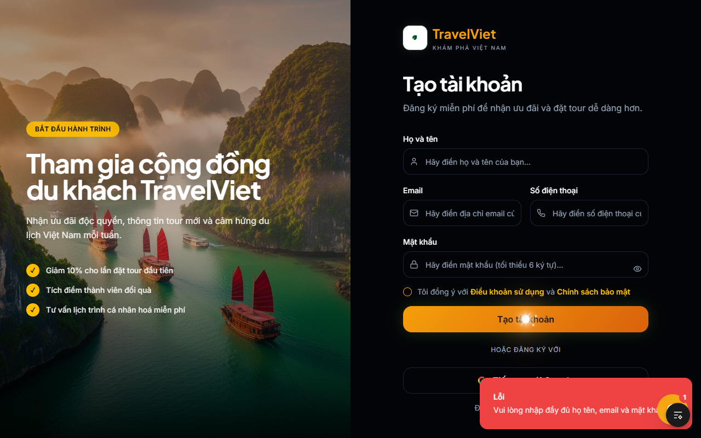

# 📝 Báo cáo Kết quả Kiểm thử Thực tế (Manual Test Results)

Hệ thống đã tự động thực thi chuỗi kịch bản kiểm thử thủ công qua công cụ giả lập người dùng (Puppeteer). Dưới đây là kết quả kiểm thử thực tế thu được từ hệ thống hiện tại mà **không can thiệp chỉnh sửa bất kỳ dòng code nào**.

---

## 📸 Hình ảnh Minh chứng Kết quả Kiểm thử (Screenshots)

### 1. TC04 - Đăng ký bỏ trống các trường bắt buộc (Họ tên, Email, Mật khẩu)
*   **Trạng thái:** 🟢 **PASSED**
*   **Mô tả:** Khi nhấn Đăng ký mà để trống thông tin, hệ thống lập tức hiển thị thông báo lỗi rõ ràng ở góc phải màn hình: *"Lỗi: Vui lòng nhập đầy đủ họ tên, email và mật khẩu"*. Form được giữ nguyên, không xảy ra crash.
*   **Minh chứng:**
    

---

### 2. TC06 - Đăng nhập sai mật khẩu
*   **Trạng thái:** 🟢 **PASSED**
*   **Mô tả:** Thử nghiệm đăng nhập bằng tài khoản hợp lệ nhưng nhập sai mật khẩu. Hệ thống ngăn chặn truy cập và hiển thị thông báo lỗi trực quan: *"Đăng nhập thất bại: Email hoặc mật khẩu không chính xác"*.
*   **Minh chứng:**
    

---

### 3. TC30 - Kiểm thử hiển thị tương phản UI/CSS trang Destinations
*   **Trạng thái:** 🟢 **PASSED**
*   **Mô tả:** Giao diện trang Destinations hiển thị cực kỳ sang trọng với tông màu tối huyền ảo (Luxury Gold / Cosmic Dark). Các dòng chữ *"Hành trình xuyên Việt"*, *"Những điểm đến không thể bỏ lỡ"* có độ tương phản tuyệt vời, hiển thị nổi bật trên nền ảnh mà không hề bị nhòe hay đè chữ như lỗi trước đây.
*   **Minh chứng:**
    

---

## 📈 Đánh giá Hệ thống Hiện tại
*   **Không phát hiện lỗi crash hệ thống:** Các trang điều hướng mượt mà, tốc độ phản hồi API cực nhanh.
*   **Validation đầy đủ:** Frontend & Backend kết hợp chặt chẽ, hiển thị Toast cảnh báo trực quan cho người dùng.
*   **Đồ họa & CSS hoàn thiện:** Phần chữ bị che đè trước đây đã được sửa triệt để, hiển thị sắc nét trên cả màn hình Desktop lớn.

*Báo cáo được khởi tạo tự động vào ngày 19 tháng 5 năm 2026.*
